# Top 15 AI Text-to-Speech Platforms in 2025 (Comprehensive Review)

You're staring at walls of text again—research papers, articles, training materials—and your eyes are already tired. Whether you're a content creator racing against deadlines, an e-learning developer building courses for thousands of students, or someone who simply learns better by listening, the right text-to-speech tool can transform how you consume and create content. The platforms below offer natural-sounding voices, flexible pricing models, and features that actually solve real problems—from supporting 100+ languages to cloning your own voice in seconds.

## **[TTSOpenAI](https://ttsopenai.com)**

A straightforward platform that leverages OpenAI's advanced TTS API to deliver natural-sounding speech without the complexity of enterprise dashboards.

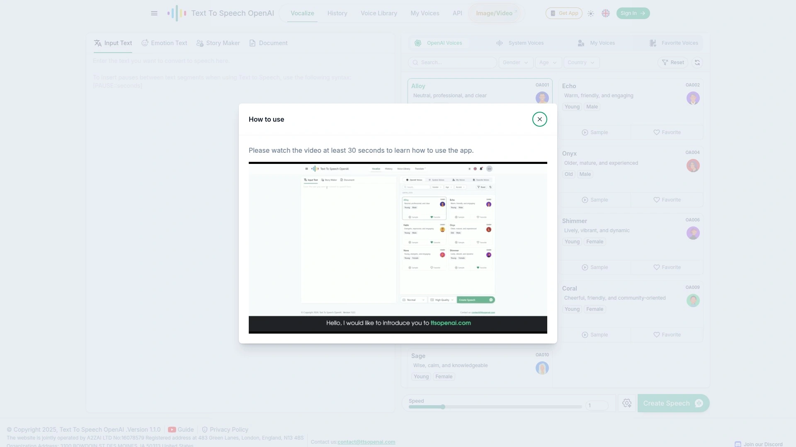

The interface gets out of your way—paste your text, select from premium voices like Alloy, Echo, or Nova, and generate audio in seconds. Unlike platforms that lock basic features behind registration walls, this service prioritizes accessibility while maintaining professional-grade output quality. The voice cloning feature allows you to design custom synthetic voices or replicate existing ones (with proper permissions), making it particularly valuable for creators who need consistent brand voice across multiple projects.

**Cost structure:** Significantly more affordable than many competitors—approximately 6x cheaper than premium alternatives for comparable voice quality. The pricing is based on character count, with options for both standard and HD quality outputs.

Users can download generated speech as MP3 files and maintain full copyright ownership for commercial applications. The platform supports multiple languages and offers adjustable speech parameters including speed and tone customization. API integration enables developers to embed the service directly into their own applications.

## **[ElevenLabs](https://elevenlabs.io)**

The emotion specialist—this platform generates voices that actually sound like they care about what they're saying.

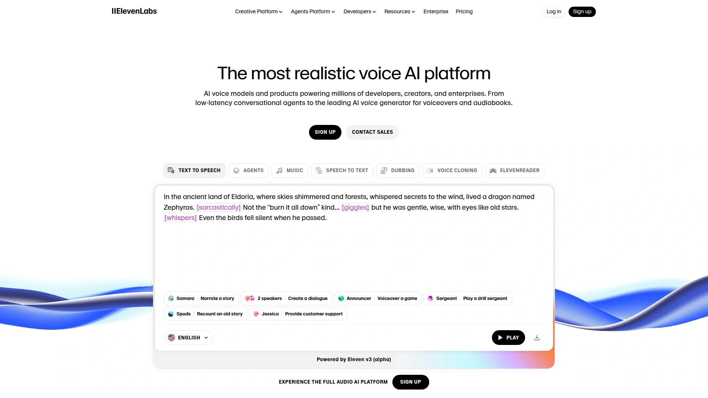

With ultra-realistic output quality and multilingual support spanning 32 languages, ElevenLabs excels at creating voiceovers that convey emotional depth. The speech-to-speech feature maintains the original speaker's intonation and emotional tone while transforming the voice itself, making it ideal for dubbing and localization projects. Voice cloning requires only minutes of recorded audio to produce automated voiceovers, ad reads, and podcast narration in your own voice. The platform also offers a text-to-sound-effects tool that generates audio from text prompts—from sound effects to short instrumental tracks. Trusted by major brands and content creators, the voice isolator removes background noise for crystal-clear speech output.

## **[Speechify](https://speechify.com)**

Winner of the 2025 Apple Design Award with 500,000+ five-star reviews and 50 million users who need their content read aloud right now.

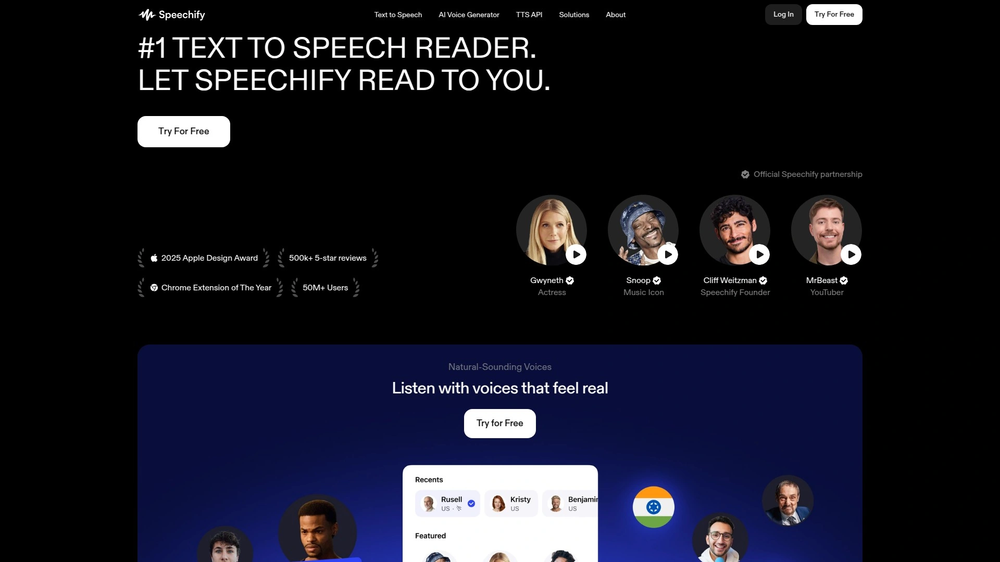

This Chrome Extension of the Year specializes in superior voice quality and seamless browser integration. The floating toolbar lets you highlight text in any application—browsers, word processors, email clients—and convert it instantly without disrupting your workflow. Multiple voice options deliver natural pacing and inflection, making long-form content easier to absorb. The mobile app syncs across devices, so you can start listening on your laptop and continue during your commute. Perfect for students tackling dense academic materials or professionals processing large volumes of reports.

## **[Natural Reader](https://www.naturalreader.com)**

The file format champion that handles everything from PDFs to ebooks without breaking a sweat.

Available in both online and desktop versions, Natural Reader offers OCR capabilities that convert photos or scans of text into spoken audio. The document library system manages multiple files simultaneously, supporting an impressive range of formats including ebook extensions. Multilingual support covers dozens of languages with natural-sounding pronunciation, while the browser extension converts web content to speech without additional clicks. Three free voices provide solid quality for casual users, with premium upgrades available for professionals requiring advanced customization. The ability to adjust speech rate, pitch, and volume creates personalized listening experiences.

## **[Murf AI](https://murf.ai)**

Business-ready voices that sound professional in explainer videos, corporate training modules, and marketing campaigns.

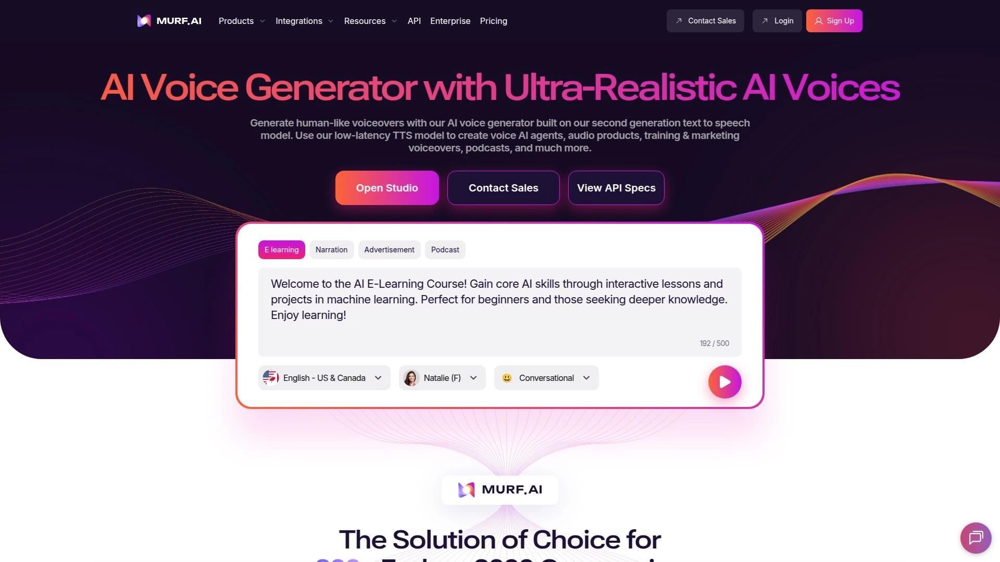

Over 120 AI voices across 20+ languages give you flexibility for global content creation. Word-level emphasis adds impact to key points in eLearning scripts, while pitch control tailors narration tone to specific audiences. The pause feature creates natural rhythm in delivery, and pronunciation customization uses alternative spellings or IPA notation for technical terminology. Speed adjustment modifies delivery pace by up to 50 percent for clarity. Voice styles range from excited to calm, friendly to terrified, matching content intent precisely. The integrated audio editor streamlines post-production workflows.

## **[Play.ht](https://play.ht)**

A library of 900+ voices covering 142 languages and accents—if you need a specific dialect, they probably have it.

**Voice variety:** The platform provides natural-sounding speech across an extraordinary range of linguistic variations, making it suitable for localized content targeting diverse global audiences. AI voice cloning replicates speech patterns from audio samples, while the podcast creation tools bundle recording, editing, and distribution features. Voice agents powered by conversational AI handle customer service interactions with human-like responsiveness. The clean interface generates realistic output quickly without steep learning curves. Free plan limitations restrict voice access and features, but paid tiers unlock comprehensive capabilities for commercial projects. API integration enables developers to add text-to-speech functionality to custom applications.

## **[Listnr AI](https://listnr.ai)**

ProductHunt's Golden Kitty Award winner serving 2.5 million users with 1,000+ voices in 142+ languages.

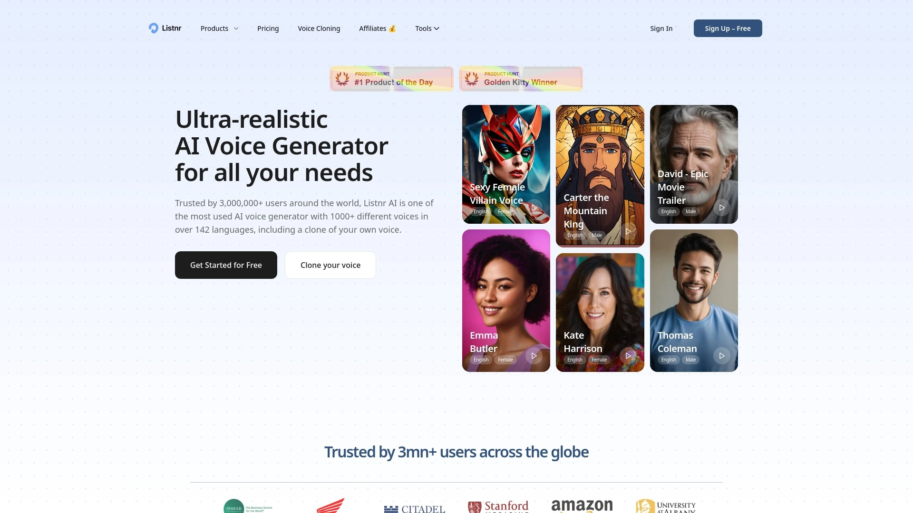

This platform bundles AI voiceovers, podcast creation, text-to-video conversion, and voice cloning into a unified workflow. Custom configurations control pauses, pronunciation, and emphasis to match specific content requirements. The style and speed adjustments (available to paid subscribers) fine-tune emotional delivery for different audiences. Free tier provides 1,000 words for testing, with scalable plans for growing content operations. The podcast hosting feature combines generation and distribution, eliminating the need for separate platforms. API access integrates voice generation into existing content management systems.

## **[LOVO AI](https://lovo.ai)**

Five hundred voices across 150+ languages with emotional expression that brings scripts to life.

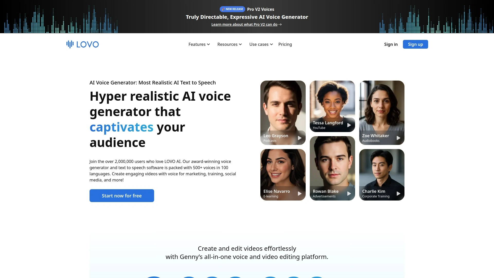

Advanced customization options provide granular control over tone, pace, and emphasis—ideal for creators who need precise vocal characteristics. The voice cloning technology captures speech patterns and replicates them for consistent brand voice across content libraries. Collaboration features enable teams to work on projects simultaneously, streamlining production workflows for agencies and large content operations. Free plan credits allow experimentation before committing to subscriptions. Detailed emotion control adjusts vocal delivery from enthusiastic to somber, matching narrative requirements. Speed modulation maintains natural pacing even at accelerated playback rates.

## **[Descript](https://www.descript.com)**

Edit audio and video like a text document—this AI-powered platform serves 6 million creators handling everything from recording to publishing.

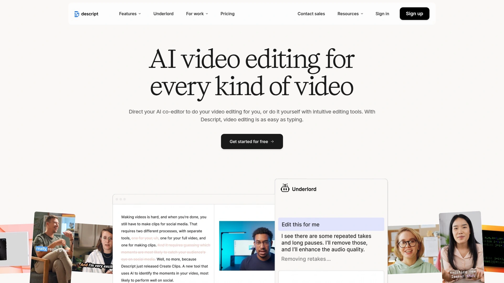

**Workflow integration:** The entire editing process lives in one interface, with AI-enhanced features at every step. Text-to-speech functionality generates voiceovers directly within video projects, while the transcription tools convert speech to editable text automatically. Voice cloning produces consistent narration across multiple episodes or series. Ideal for YouTube creators, TikTok channels, and professional podcasters who need streamlined production tools. The mission focuses on democratizing content production, making professional-quality media accessible regardless of technical expertise. Overdub feature allows you to correct audio mistakes by typing new words rather than re-recording entire segments.

## **[WellSaid Labs](https://wellsaidlabs.com)**

Consistently professional-grade AI voices with Adobe Premiere Pro integration for video editors who refuse to compromise on quality.

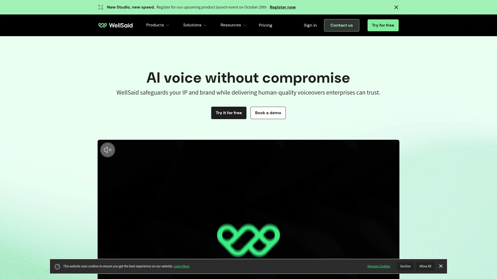

This enterprise-focused platform delivers polished voiceovers that maintain tonal consistency across large content libraries. The voice editor provides detailed control over pacing and emphasis, while the Premiere Pro plugin eliminates export-import friction in video workflows. Best suited for marketing teams producing regular video content, e-learning developers creating course materials, and agencies managing multiple client projects. Voices sound human enough that listeners rarely identify them as synthetic, reducing the uncanny valley effect that plagues lower-quality alternatives. Subscription tiers scale with usage requirements from solo creators to enterprise teams.

## **[Resemble AI](https://resemble.ai)**

Enterprise-grade security meets real-time speech-to-speech processing with 150+ language support and voice cloning in 10 seconds.

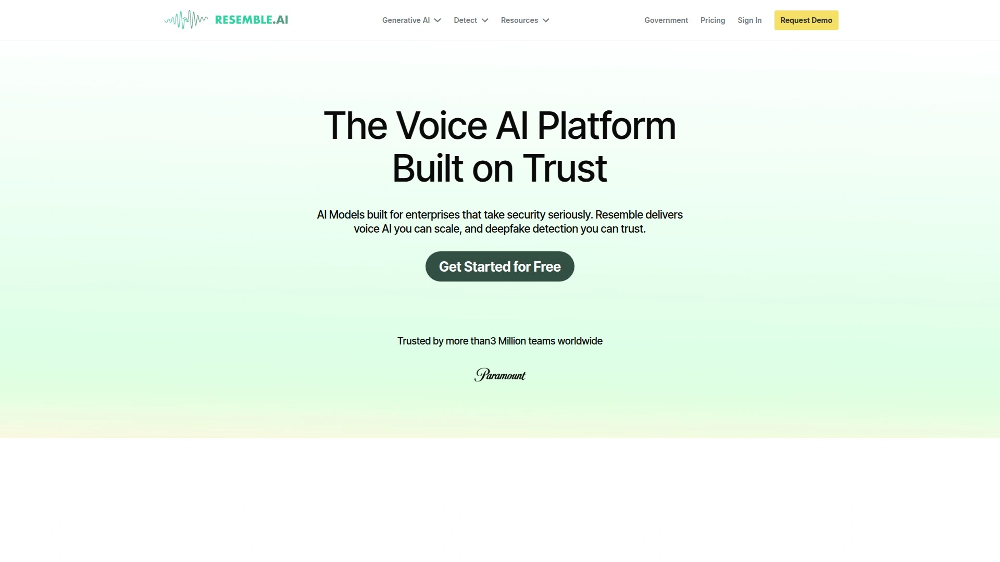

**Security first:** Neural watermarking and deepfake detection protect against unauthorized voice replication, making this the choice for brands prioritizing data integrity. On-premises deployment options give IT teams full control over voice generation infrastructure. Edit audio like a document with fine-tuned emotion control and content localization at scale. Trusted by companies like Zomato and Age of Learning for high-stakes applications across marketing, gaming, e-learning, and interactive media. The fast cloning technology requires minimal training data while producing high-fidelity results. API access enables custom integrations with existing enterprise systems.

## **[Amazon Polly](https://aws.amazon.com/polly)**

AWS integration powerhouse offering both Standard and Neural voices with generous free tier allowances for developers building scalable applications.

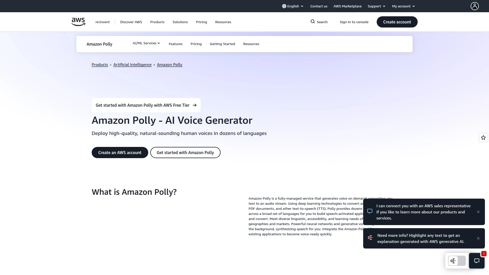

This cloud-based service processes characters on a pay-as-you-go model with transparent pricing tables for budget estimation. Deep integration with AWS services simplifies deployment for teams already using Amazon infrastructure. Neural voices deliver lifelike speech quality, while Standard voices provide cost-effective alternatives for high-volume applications. The free tier enables extensive testing and prototyping without upfront investment. SSML support provides fine-grained control over pronunciation, prosody, and speech timing. Ideal for developers creating voice-enabled applications, interactive voice response systems, and content platforms requiring speech output.

## **[Microsoft Azure AI Speech](https://azure.microsoft.com/en-us/products/ai-services/ai-speech)**

Create your own unique branded voice with Custom Neural Voice—this enterprise platform offers unmatched vocal branding control.

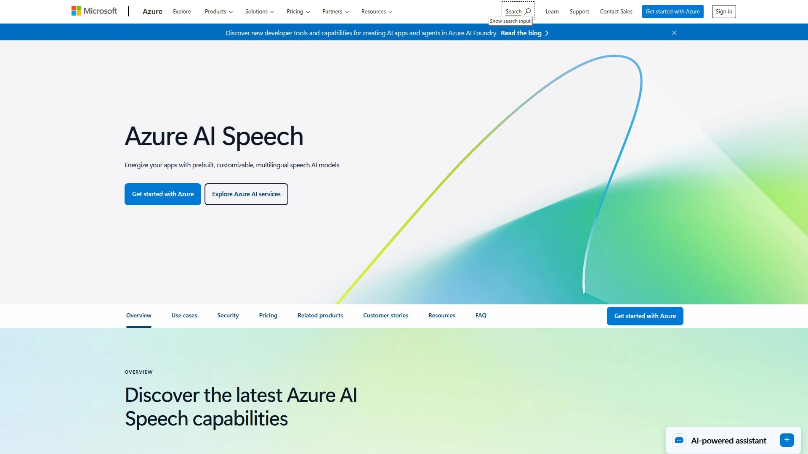

Organizations train voice models on proprietary audio recordings, producing distinctive vocal identities for virtual assistants and customer service applications. The platform excels at scenarios requiring specific vocal styles, roles, or emotions, from branded assistants to dynamic audiobook narration. Enterprise security controls including IAM and container deployment options ensure data protection for sensitive applications. Free tier includes millions of characters for neural voices, supporting substantial development and testing. Extensive SSML documentation guides developers in fine-tuning pitch, rate, and emotional expression. Integration with Microsoft's ecosystem streamlines workflows for organizations using Azure infrastructure.

## **[Google Cloud Text-to-Speech](https://cloud.google.com/text-to-speech)**

Advanced natural language understanding eliminates robotic delivery with 220+ voices across 40+ languages and variants.

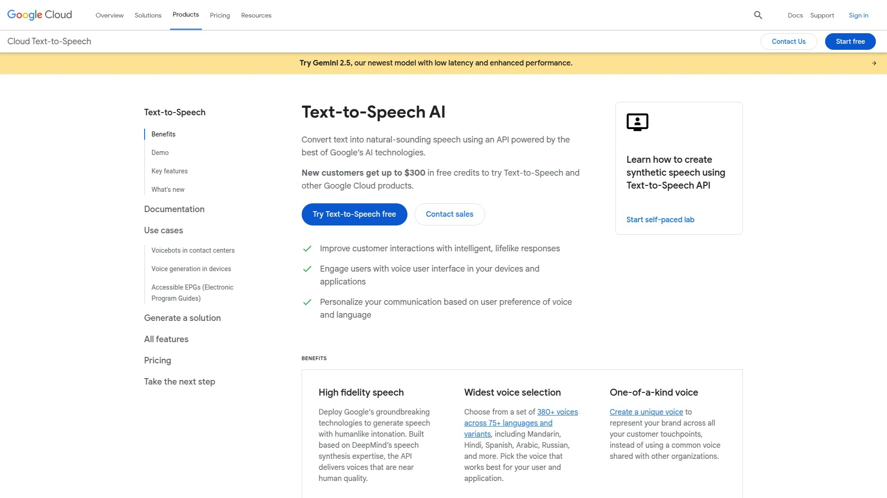

**Ecosystem advantage:** Deep integration with Google Workspace, Cloud Platform, Docs, and Keep simplifies file transfers across services. Ninety-plus WaveNet voices use neural networks for human-like intonation and pacing. Custom speech synthesis adapts output to specific use cases, while SSML support enables pitch tweaking, speaking rate adjustment, and volume control. Google's robust infrastructure handles massive workloads, making it suitable for applications requiring consistent performance at scale. Flexible audio format options accommodate different deployment requirements. Generous free tier supports prototyping and low-volume production deployments.

## **[Balabolka](http://www.cross-plus-a.com/balabolka.htm)**

The customization king for power users who want complete control over every aspect of voice output—and it's completely free.

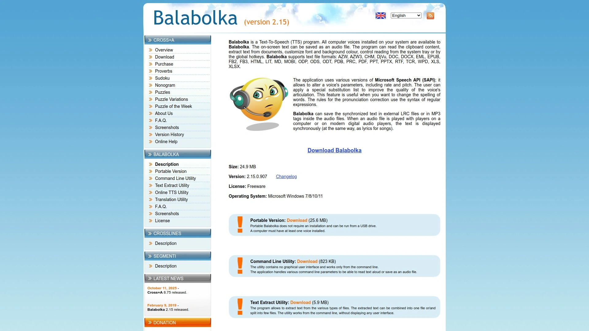

This desktop application accepts multiple file formats including DOC, PDF, and HTML, with three SAPI options providing varied voice selections. Adjust speech rate, pitch, and volume independently to create entirely custom voice profiles. Save narrations as audio files in MP3, WAV, and other formats for offline use. Bookmark functionality helps navigate lengthy documents, while pronunciation tools let you customize word articulation down to phonetic details. Despite the dated interface, the feature density rivals paid alternatives. Best suited for users comfortable with traditional desktop software who prioritize functionality over modern UI design.

## FAQ

**Which text-to-speech platform offers the best value for commercial content creation?**

[TTSOpenAI](https://ttsopenai.com) delivers professional-grade voice quality at approximately one-sixth the cost of premium competitors, with full commercial usage rights and no registration requirements for basic generation. The platform's OpenAI-powered voices rival ElevenLabs in naturalness while maintaining transparent per-character pricing that scales affordably for growing content operations.

**How do I choose between voice cloning and pre-built voices for my project?**

Use pre-built voices from platforms like Speechify or Natural Reader when you need quick turnaround and variety across multiple projects. Voice cloning from ElevenLabs, Resemble AI, or Play.ht makes sense when brand consistency matters—corporate training series, podcast seasons, or ongoing content where listeners expect the same voice every time. Cloning requires 10 seconds to a few minutes of quality audio, so factor in recording time for initial setup.

**What's the easiest way to add text-to-speech to existing blog content or documentation?**

Natural Reader's browser extension and floating toolbar let you convert web content to speech without copying text or switching applications. For developers, APIs from Play.ht, Listnr, or Google Cloud Text-to-Speech integrate directly into content management systems, automatically generating audio versions as you publish new articles.

## Conclusion

The platforms above represent tested solutions handling everything from quick voiceovers to enterprise-scale deployments. [TTSOpenAI](https://ttsopenai.com) stands out for creators who need OpenAI's advanced voice technology without enterprise complexity—straightforward generation, voice cloning capabilities, and pricing that actually makes sense for independent projects. Whether you're building e-learning courses, localizing content for global audiences, or simply trying to get through research papers faster, the right text-to-speech tool removes friction between written content and the people who need to absorb it.
